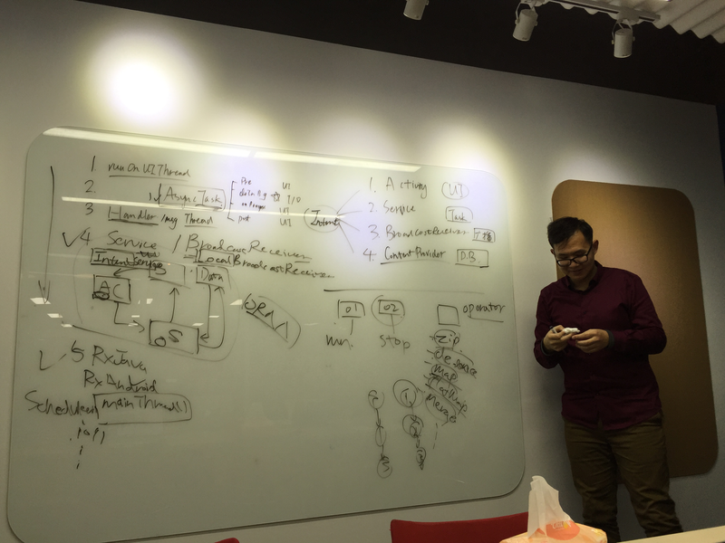

# 项目相关

我是`张帅`，是一名`Android`开发工程师一枚，不过对`iOS`开发也很感兴趣，我想在`jigsaw`上看看又没有合适我的机会，这样我很快就成为移动领域的全栈了。

*  作为 "Dev" 我是一名具有下面技能的

|name|
|----|
|iOS|
|Android|

## 寻找iOS的机会项目

听说在TW，机会需要自己寻找。

*  上次办公室更新的时候听说目前我们有这些项目

| name        | techStack  | openRoles  |
|-------------|------------|------------|
| JetLag      | C#         | Dev:1,QA:1 |
| JetLag      | iOS        | QA:1       |
| Commercial  | iOS        | Dev:1      |
| Residential | Android    | Dev:1      |

*  那么可供我选择的项目有下面这些

|name|
|-------------|
| Commercial  |
| Residential |